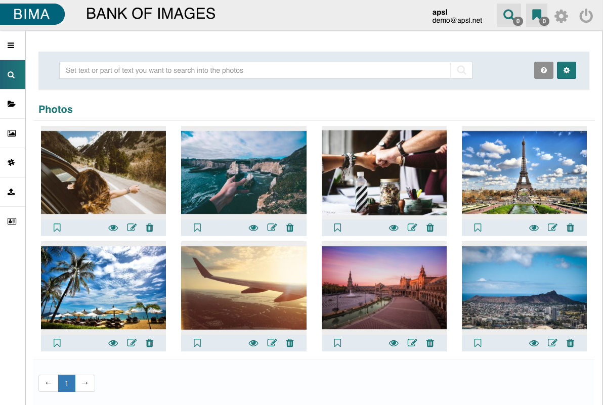
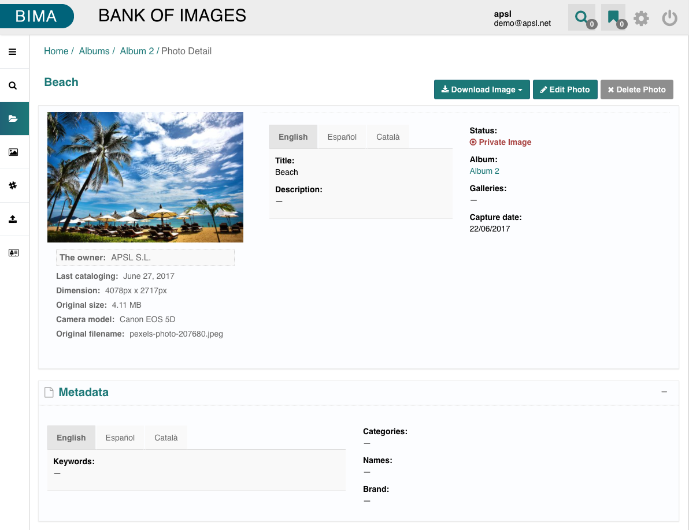
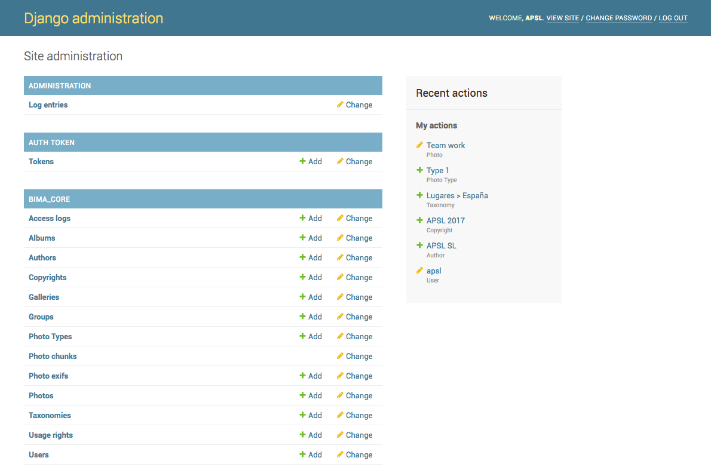

====
BIMA
====

BIMA (Bank of IMAges) is a ready to use DAM application. 

Functional Description
------

BIMA is a DAM application developed to organize and manage digital images assets, with built-in cataloging, indexing and advanced search functionalities. The images are organized based on albums and galleries (one image can belong exclusively to one album, as well as multiple galleries). The access to the images depends on the user profile and assigments to the gallery or album. 

The application is multilingual (both in the interface and the metadata support - titles, descriptions, keywords, taxonomies). All the photos and galleries can be consumed via web service (REST), making easy the integration and centralized management of the information.

* Organizing the pictures based on albums and galleries 
* Cataloging the pictures with title, description, keywords, categories (taxonomy), names, authors' rights and licenses, technical information. 
* Geolocation (integration with Google Maps)
* It supports a variety of formats (jpg, tif, gif, png, psd, among others)
* It supports image resizing (it offers 6 different sizes)
* Batch edition and upload
* User management based on profiles (admin, editor, photographer, reader) and assignments to albums and galleries
* Logs
* Multi-language Cataloging supports
* Multi-language User interface
* API REST interface
* Web Responsive
* It allows authentication based on username/password or LDAP
* Highly scalable architecture, cloud-oriented, it supports a high volume of images and users. 

Technical Description
------

It is composed of 4 repositories:

* `django-bima-core <https://github.com/AjuntamentdeBarcelona/django-bima-core>`_: Django app to manage digital assets via REST API and Django admin.
* `django-bima-back <https://github.com/AjuntamentdeBarcelona/django-bima-back>`_: Django backoffice app to manage digital assets.
* `bima-core <https://github.com/AjuntamentdeBarcelona/bima-core>`_: Example deploying a django-bima-core based project.
* `bima-back <https://github.com/AjuntamentdeBarcelona/bima-back>`_: Example deploying a django-bima-back based project.

The application integrates with Thumbor for the image processing and resizing (thumbnail generation). 

PostgreSQL Database. 

Installation and run
--------------------

* TODO: Dockerize the project.

Screenshots
-----------

|

|

